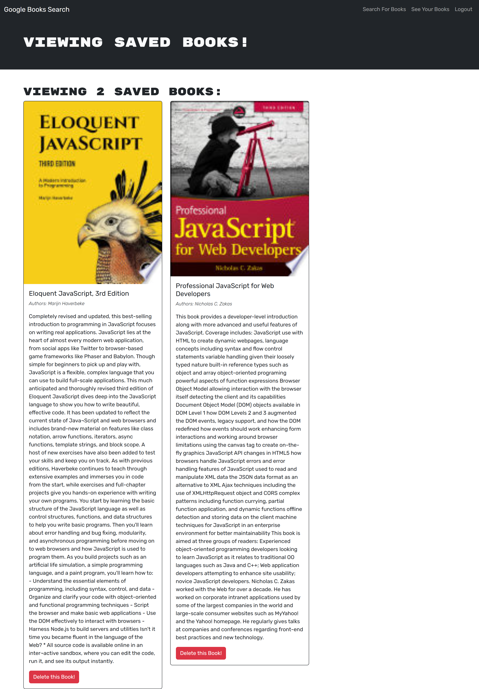

# MERN: Books Search Engine

## User Story

```md
AS AN avid reader
I WANT to search for new books to read
SO THAT I can keep a list of books to purchase
```

## Acceptance Criteria

```md
GIVEN a book search engine
WHEN I load the search engine
THEN I am presented with a menu with the options Search for Books and Login/Signup and an input field to search for books and a submit button
WHEN I click on the Search for Books menu option
THEN I am presented with an input field to search for books and a submit button
WHEN I am not logged in and enter a search term in the input field and click the submit button
THEN I am presented with several search results, each featuring a book’s title, author, description, image, and a link to that book on the Google Books site
WHEN I click on the Login/Signup menu option
THEN a modal appears on the screen with a toggle between the option to log in or sign up
WHEN the toggle is set to Signup
THEN I am presented with three inputs for a username, an email address, and a password, and a signup button
WHEN the toggle is set to Login
THEN I am presented with two inputs for an email address and a password and login button
WHEN I enter a valid email address and create a password and click on the signup button
THEN my user account is created and I am logged in to the site
WHEN I enter my account’s email address and password and click on the login button
THEN I the modal closes and I am logged in to the site
WHEN I am logged in to the site
THEN the menu options change to Search for Books, an option to see my saved books, and Logout
WHEN I am logged in and enter a search term in the input field and click the submit button
THEN I am presented with several search results, each featuring a book’s title, author, description, image, and a link to that book on the Google Books site and a button to save a book to my account
WHEN I click on the Save button on a book
THEN that book’s information is saved to my account
WHEN I click on the option to see my saved books
THEN I am presented with all of the books I have saved to my account, each featuring the book’s title, author, description, image, and a link to that book on the Google Books site and a button to remove a book from my account
WHEN I click on the Remove button on a book
THEN that book is deleted from my saved books list
WHEN I click on the Logout button
THEN I am logged out of the site and presented with a menu with the options Search for Books and Login/Signup and an input field to search for books and a submit button
```

## Table of Contents

- [Description](#description)
- [Technologies](#technologies)
- [Installation](#installation)
- [Usage](#usage)
- [Screenshots](#screenshots)

## Description

Today's modern websites are driven by data and user demands. The ability to personalize user data is crucial in the current and future web development landscape. As user demands evolve, applications must adapt and become more performant. 
Therefore, to keep up with the current demands, some existing fully function applications need to implement the technologies for it. In the same way, the goal of this project is to work on the starter code with a fully functioning Google Books API search engine built with a RESTful API, and refactor it to be a GraphQL API built with Apollo Server. The app was built using the MERN stack with a React front end, MongoDB database, and Node.js/Express.js server and API. It's already set up to allow users to save book searches to the back end.


## Technologies

- Apollo/client/server
- Express.js
- GraphQL
- Heroku
- JavaScript
- JSON Web Tokens
- Mongoose ODM
- Node.js
- NoSQL/ MongoDB
- React

## Installation

In order to be able to run the applicaton, you are required to do the following:

- Download the zip file/ clone the GitHub repo
- Open the folder in VSCode
- Click the "Toggle Panel" on the right-side or "Ctrl+J" to see the Terminal or Command Line Interface(CLI)
- Install npm (Node Package Manager) inside the repo by typing the following code in the Command Line:

```
    npm install               Press Enter
```

## Usage

To use the application,

- You need to do, "npm install" if you haven't done in the Installation section above.
- Type the following commands in the Command Line to run and test the GraphQL `server-side` application:

```
    npm start               Press Enter
```

- Type the following commands in the Command Line to run both client side and server side. Then test the application from the frontend, `client-side`:

```
    npm run develop               Press Enter
```

- Then, test all the functions and features.

```md
- Create an account
- Login:
  - Search books
  - Save books
  - View saved books
  - Delete saved books
```

- The application is deployed on Heroku. Visit the live website by [clicking here](https://skhai77-book-search-68bcdb67366a.herokuapp.com/).

## Screenshots

The following image shows the book search results with a "`Save this Book!`" button on each book:


The following image shows the "`Save this Book!`" button is clicked for saving books as the button is changed to `This book has already been saved!`:


The following image shows the view of saved books under "`See Your Books`" menu:


